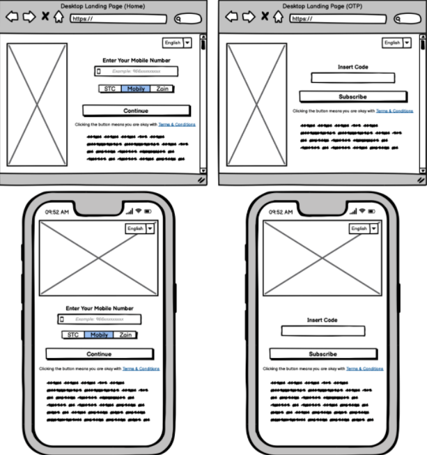

# Next Stage Frontend Task

## Software Developer: Abdelqader Al-Omari

## Problem Domain

Assuming Next Stage Company is going to launch a new mobile service for sports news, we need a landing page for the service for the users to subscribe to it, please follow these notes:

- Use images, Animations and Videos.
- Animate some parts of the design.
- The page must be fully responsive.
- The page should be multilingual.
- The changing language process should be done with JavaScript (in the same page with no redirect).

## Wireframes

## Features

- Fully Responsive.
- Video promo for sports (I made it by video editor)
- Slide show (animated high-quality images)
- Multilingual (fast with no redirect, and don't need to reload the page, also if reload : will keep the last selected language)
- UI/UX Friendly
- Using creative color pallet (from Next Stage logo colors)
- Clean code and well structured

## Languages and libraries

- HTML5
- CSS3
- JS
- Bootstrap
- Font Awesome (only for mobile logo)

## LandPages References

1. https://web.lamsaworld.com/vas/mobility/ar
2. https://kidsflix.appandix.com/cg/
